# [House Plant Heaven](#title)

## [Description](#description)
**House Plant Heaven** is a mobile-responsive, e-commerce platform in which users can browse and purchase a wide variety of organic, responsibly raised house plants and flowers. Customer's shopping experience is enhanced with intuitive features, like product filter buttons, one-step signup and login process, and a user-friendly, secure payment process (using Stripe payment). The platform also leverages a leading-edge tech stack, using packages, such as MongoDB, Mongoose, Apollo, Express, React, and Node, thus ensuring a durable solution lifecycle. Additonally, the application is a progressive web application (PWA), allowing users to continue to shop while network service is unavailable.

> - Project Repository URL: https://github.com/mssjhu9/mern-react
> 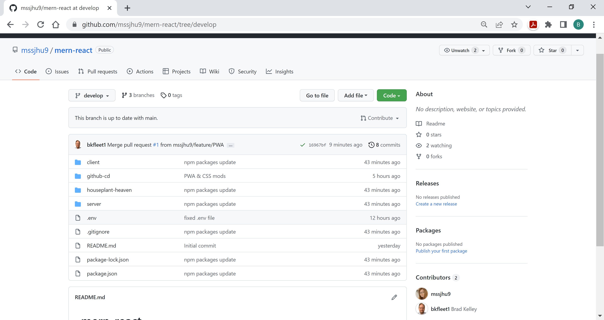

> - Project Deployment URL: https://houseplant22.herokuapp.com
> 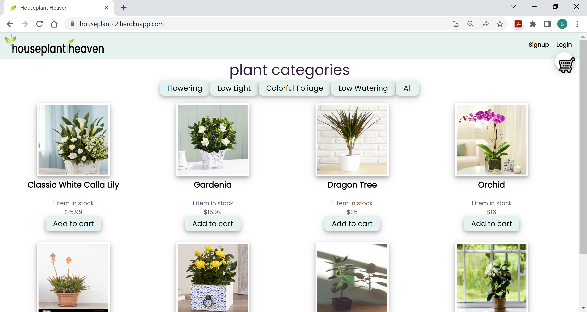

## Table of Contents
> - [Title](#title)
> - [Description](#description)
> - [Developers](#developer)
> - [Packages & Libraries](#resources)
> - [Tech Stack](#stack)
> - [Installation](#installation)
> - [Use Instructions](#usage)
> - [Tests](#tests)
> - [Questions](#questions)

## [Developers](#developer)
1. [Maria Jayakumar](https://mssjhu9.github.io/react-portfolio)
2. [Jamie Jackson](https://JJackson510.github.io/React-portfolio)
3. [Brad Kelley](https://bkfleet1.github.io/portfolio/)

## [Packages & Libraries](#resources)
The following resources were used in the development of this project.

> - @apollo/react-hooks v.3.1.3
> - @stripe/react-stripe-js v.1.4.1
> - @stripe/stripe-js v.1.3.1
> - @testing-library/jest-dom v.4.2.4
> - @testing-library/react v.9.5.0
> - @testing-library/user-event v.7.2.1
> - apollo-boost v.0.4.7
> - apollo-link-context v.1.0.20
> - apollo-server-express v.2.25.2
> - bcrypt v.4.0.1
> - bootstrap v.5.0.0
> - create-react-app v.1.2.1
> - express v.4.17.1
> - graphql v.15.5.1
> - graphql-tag v.2.10.3
> - jsonwebtoken v.8.5.1
> - jwt-decode v.2.2.0
> - mongodb atlas v.5.0.6
> - mongoose v.5.9.7
> - react v.16.13.1
> - react-dom v.16.13.1
> - react-router-dom v.5.1.2
> - react-scripts v.3.4.1
> - stripe v.8.67.0

## [Tech Stack](#stack)
   

> - HTML 5
> - JavaScript
> - CSS

## [Installation](#installation)
NOTE: This application requires Node.js (version ^16.14.2) and MongoDB (version ^5.0.6). The installation instructions below do not describe how to install Node.js and MongoDB. Additionally, the instruction assume that you have successfully installed both applications prior to installing **House Plant Heaven**. You can download the latest versions of these Node.js and MongoDB from the following URLs:

> * [Node.js](https://nodejs.org/en/) - https://nodejs.org/en/

> * [MongoDB](https://www.mongodb.com/try/download/community) - https://www.mongodb.com/try/download/community

The following steps are required to execute the **House Plant Heaven** application.
> 1. Clone the repository located at: https://github.com/mssjhu9/mern-react.
> 2. Open the project in a terminal application, such as git bash, and simply type **npm install** and press enter. 

## [Use Instructions](#usage)
After the installation process, you are ready start the application (Client) and middleware (Server) servers. Just open the project in a terminal application, such as git bash, and type "**npm start**" and press enter. Your initialized application and middleware server should resemble the image below.

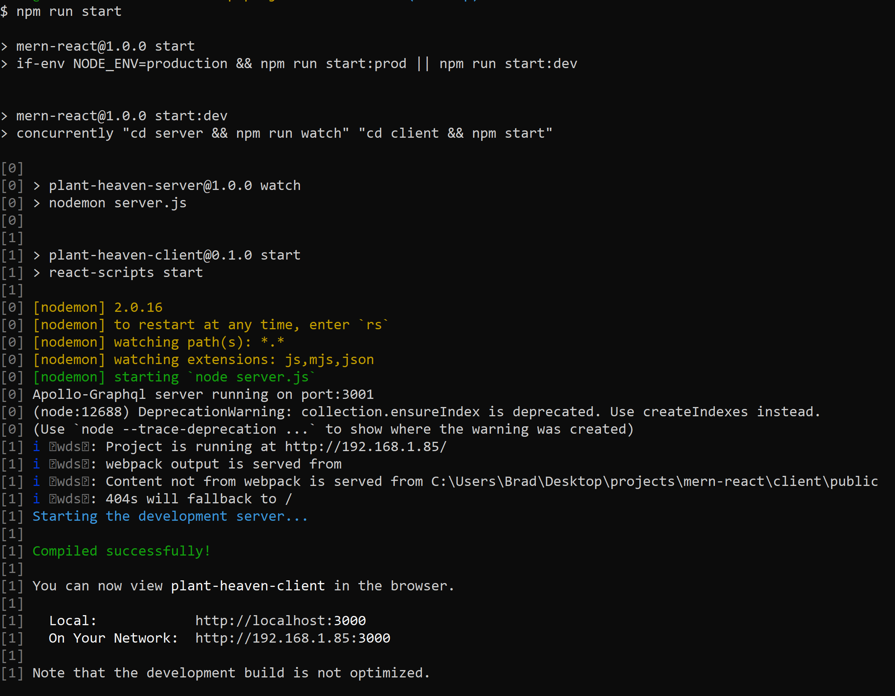

The application will create the **House Plant Heaven** database named **housePlantStoreDb** in MongoDB, which includes four collections: **categories**, **orders**, **products** and **users**. The image below illustrates the the application's database running in MongoDB.

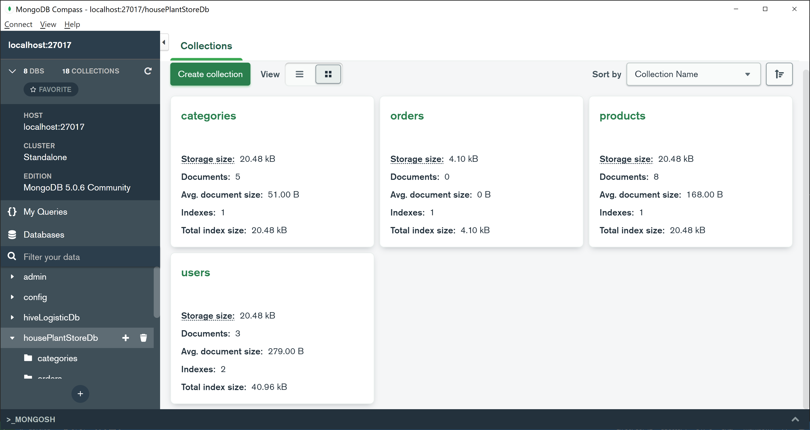

### Main Screen
Upon application launch the user will be presented with a **Main** screen. As the name suggests, the **main screen** is the primary user interface from which the application user is able to browse available **product items**. Only authenticated users will be able to purchase items.

### Product Filter
Within the **main** screen users can filter the **product item** list presented. When the user clicks on the **product filter** buttons located above the product list, the application will filter the product list to show items relevant to the filter the user selected. The image below illustrates this feature.

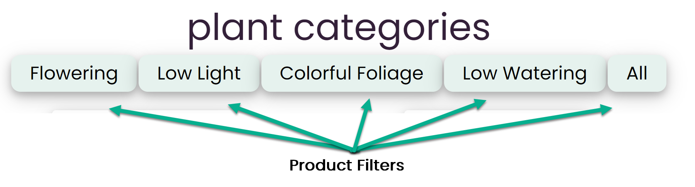

### Product Item
As previously noted, within the **main screen** the user will be presented one or more **product items**. Each product item includes an image, name, current on-hand inventory, and a per-unit price. Additionally, the **product item** includes an **add to cart** button. The image below illustrates this feature.

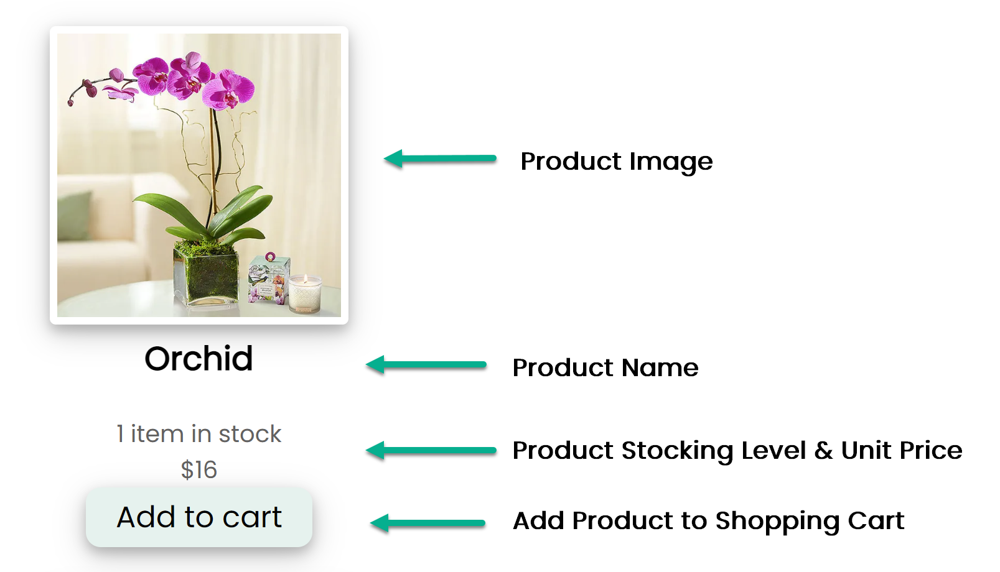

When the user clicks on a **product item's** image, the user will be presented with a new screen presenting the **product item's** image, name, current on-hand inventory, and a per-unit price.

When the user clicks a product item's **add to cart button**, the application will add a quantity of one of the **product item** to the user's shopping cart. This function is available to the user both from the **main** screen as well as the individual product item's screen previously described.

### Login Form
When the user clicks on the **Login** hyperlink in the upper right corner of the viewable screen, then the user is presented with an application **login form** that includes a link to **signup** in the upper right corner of the viewing area. The following image illustrate the user **login form**.

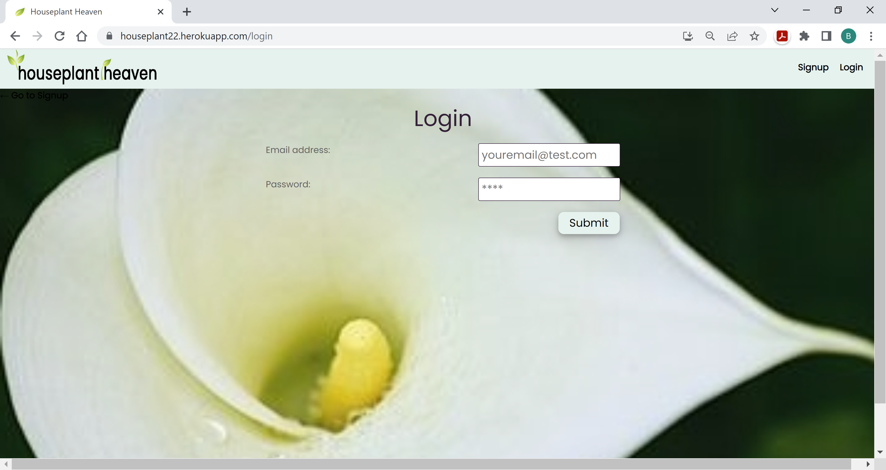

When the user enters a registered **email address** and **password** into the **login form** and clicks the **login button**, then the application verifies the user’s credentials; if the user has valid credentials, the application will (1. Issue a cookie to the user’s browser, (2. Log the user’s session in the application’s database, and (3. Redirect the user to the **main screen**.

### Signup Form
When the user clicks on the **signup** link from the **login** screen, then the user is presented a **signup form** that includes the user’s first and last name, username, email, address and password. The following image illustrate the user **signup form**.

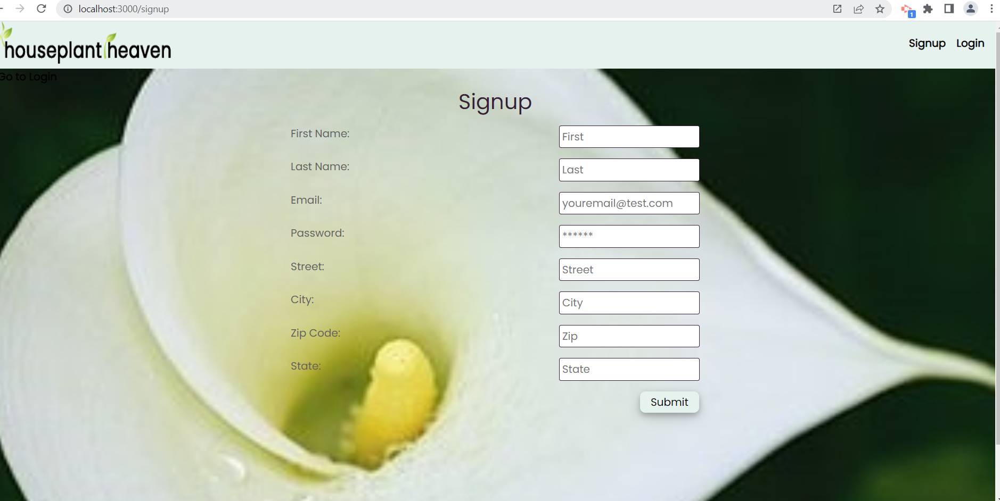

When the user has successfully completed the **signup form** form and clicks the **signup button**, then the user-provided information is validated; if the information passes the validation checks, an account is created and the application returns the user to the **login form**; else the application provides an error message.

### Shopping Cart
The application shall provide users with a shopping cart icon **🛒** in the upper right corner of the **main** screen.  

When a user clicks on the shopping cart icon **🛒**, the user is presented with **product items** selected for purchase. If the user has not selected any **product items** to purchase, then the application will present the user with a message indicating that "You haven't added anything to your cart yet!". This image below illustrates the application's shopping cart feature.

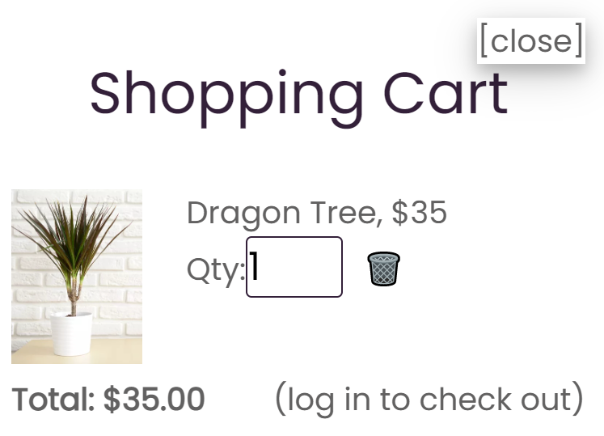

When a user changes the quantity of a **product item** in their shopping cart, the **total amount** of the cart's purchase value will change to reflect the change in quantity. 

When a user clicks on the garbage can icon to delete a **product item** in their shopping cart, the item will be removed from the shopping cart and the **total amount** of the cart's purchase value will be changed to reflect the value of the deducted item.

When a logged in user clicks on the **checkout** button in their shopping cart, the application shall present the user with the **Stripe Payment Checkout** form.

### Stripe Payment Checkout
Only a user that has an application account and logged in may complete a purchase using the **Stripe Payment Checkout** function. A user that is not logged in will see a message with a link in the lower right corner of their shopping car indicating "log in to check out". Whereas as user that is logged in will be presented with a **checkout** button.

As previously noted, when a logged in user clicks on the **checkout** button in their shopping cart, the application shall present the user with the **Stripe Payment Checkout** form, which is used to record and process the user's payment information. An image of this screen is shown below.

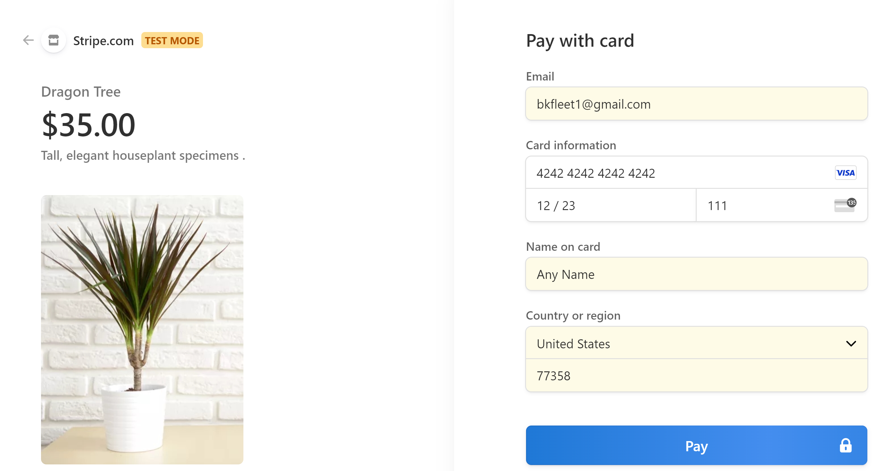

When a user completes the **Stripe Payment Checkout** and clicks the **Pay** button, Strip Payment Services shall validate the information provided by the user. The user will receive an error message if the payment information provided is incorrect or payment was rejected. If the payment was approved, the user will be presented with a green checkmark and be redirected to a notification the transaction was successfully completed. 

**Note that the configuration for the Stripe Payment Services is directed to a sandbox testing platform and not a production environment.**

### Payment History
When a user clicks on the **payment history** link in the upper righthand of the **main** screen, the user will be presented with recent purchases.

### Logout
A user can logout by simply clicking the **logout** button in the upper right-hand corner of the screen. Additionally, the application will automatically log a user session out after 5 minutes of idle time (i.e., 300,000 milliseconds). The idle time setting can be found in the public/javascript/script.js file.

### Progressive Web Application
As previously noted, the **house plant heaven** is a progressive web application (PWA), allowing users to continue browsing products and shopping when Internet service is not available. The following images illustrate the application's caching of a shopping cart, as well as persitent storage of the **categories** and **products** collections.

**shopping cart**
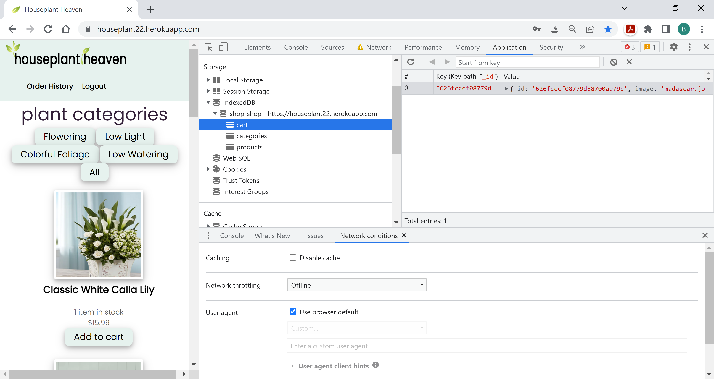

**cached categories**
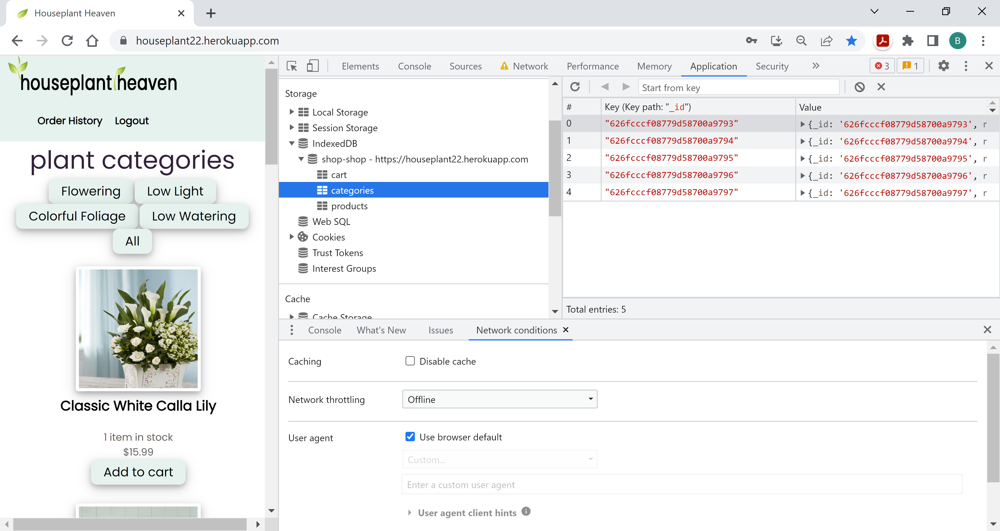

**cached products**
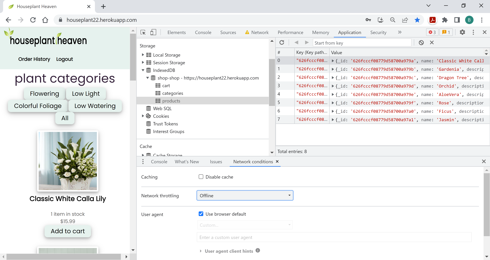

## [Tests](#tests)
No formal testing is available. However, you can seed the database with test data by opening the project in a terminal application, such as git bash, and typing **npm run seed** and pressing enter.
​
NOTE: Your testing environment should be different from the production environment described in the [Installation](#installation) section. You can create a test environment following [Installation](#installation) instructions.
​
## [Questions](#questions)
Please email one of the following developers with any questions.
> * [Maria Jayakumar](mailto:mssjhu9@gmail.com)
> * [Jamie Jackson](mailto:Jamiej.jj5@gmail.com)
> * [Brad Kelley](mailto:bradkelleytech@gmail.com) 