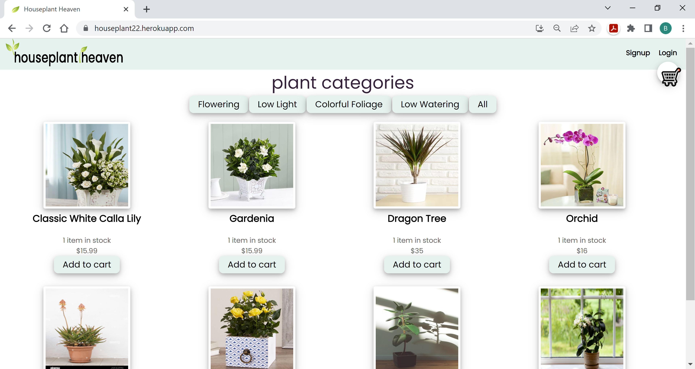
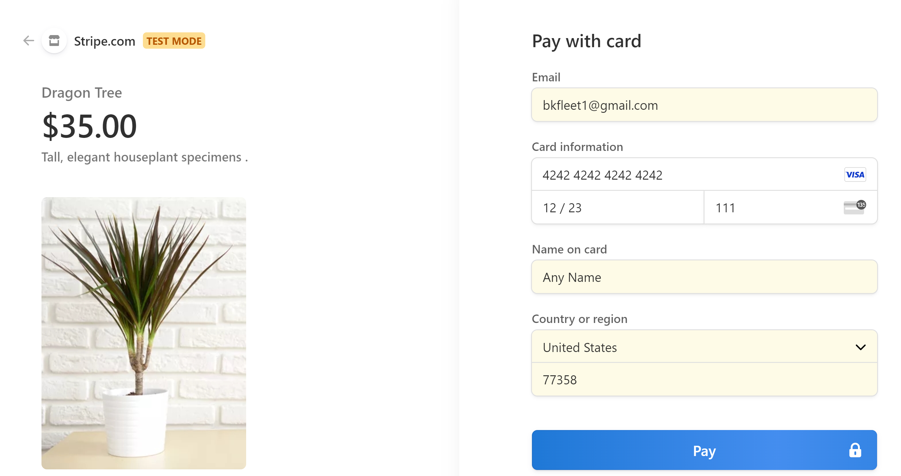

# [House Plant Heaven](#title)

## [Description](#description)
**House Plant Heaven** is a mobile-responsive, e-commerce platform in which users can browse and purchase a wide variety of organic, responsibly raised house plants and flowers. Customer's shopping experience is enhanced with intuitive features, like product filter buttons, one-step signup and login process, and a user-friendly, secure payment process (using Stripe payment). The platform also leverages a leading-edge tech stack, using packages, such as MongoDB, Mongoose, Apollo, Express, React, and Node, thus ensuring a durable solution lifecycle. Additonally, the application is a progressive web application (PWA), allowing users to continue to shop while network service is unavailable.

## Table of Contents
> - [Title](#title)
> - [Description](#description)
> - [Developers](#developer)
> - [Packages & Libraries](#resources)
> - [Tech Stack](#stack)
> - [Wireframe](#wireframe)
> - [Minimum Viable Product](#MVP)

## [Developers](#developer)
1. Maria Jayakumar
2. Jamie Jackson
3. Brad Kelley

## [Packages & Libraries](#resources)
The following resources were used in the development of this project.

> - @apollo/react-hooks v.3.1.3
> - @stripe/react-stripe-js v.1.4.1
> - @stripe/stripe-js v.1.3.1
> - @testing-library/jest-dom v.4.2.4
> - @testing-library/react v.9.5.0
> - @testing-library/user-event v.7.2.1
> - apollo-boost v.0.4.7
> - apollo-link-context v.1.0.20
> - apollo-server-express v.2.25.2
> - bcrypt v.4.0.1
> - bootstrap v.5.0.0
> - create-react-app v.1.2.1
> - express v.4.17.1
> - graphql v.15.5.1
> - graphql-tag v.2.10.3
> - jsonwebtoken v.8.5.1
> - jwt-decode v.2.2.0
> - mongodb atlas v.5.0.6
> - mongoose v.5.9.7
> - react v.16.13.1
> - react-dom v.16.13.1
> - react-router-dom v.5.1.2
> - react-scripts v.3.4.1
> - stripe v.8.67.0

## [Tech Stack](#stack)
> - HTML 5
> - JavaScript
> - CSS

## [Wireframe](#wireframe)

### Main Screen

### User Signup

### User Login

### Product Filter

### Product Item

### Shopping Cart

### Stripe Payment Checkout

## [Minimum Viable Product](#MVP)
The MVP for the proposed application is as follows:

Upon application launch the user will be presented with a **Main** screen. Only authenticated users will be able to purchase items.

**Create an Account & Login**
1. When the user clicks on the **Login** hyperlink in the upper right corner of the viewable screen, then the user is presented with an application **login form** that includes a link to **signup** in the upper right corner of the viewing area.

2. When the user clicks on the **signup** link, then the user is presented a **signup form** that includes the user’s first and last name, username, email, and password.

3. When the user has successfully completed the **signup form** form and clicks the **signup button**, then the user-provided information is validated; if the information passes the validation checks, an account is created and the application returns the user to the **login form**; else the application provides an error message.

4. When the user enters a registered **email address** and **password** into the **login form** and clicks the **login button**, then the application verifies the user’s credentials; if the user has valid credentials, the application will (1. Issue a cookie to the user’s browser, (2. Log the user’s session in the application’s database, and (3. Redirect the user to the **main screen**.

**Main Screen**
As the name suggests, the **main screen** is the primary user interface from which the application user is able to browse available products.

5. When the user clicks on the **product filter** buttons located above the product list, the application will filter the product list to show items relevant to the filter the user selected.

**Product Item**
As previously noted, within the **main screen** the user will be presented one or more **product items**. Each product item includes an image, name, current on-hand inventory, and a per-unit price. Additionally, the **product item** includes an **add to cart** button.

6. When the user clicks on a **product item's** image, the user will be presented with a new screen presenting the **product item's** image, name, current on-hand inventory, and a per-unit price.

7. When the user clicks a product item's **add to cart button**, the application will add a quantity of one of the **product item** to the user's shopping cart. This function is available to the user both from the **main** screen as well as the individual item's screen defined in MVP user story #6.

**Shopping Cart**
The application shall provide users with a shopping cart icon **🛒** in the upper right corner of the **main** screen.  

8. When a user clicks on the shopping cart icon **🛒**, the user is presented with **product items** selected for purchase. If the user has not selected any **product items** to purchase, then the application will present the user with a message indicating that "You haven't added anything to your cart yet!".

9. When a user changes the quantity of a **product item** in their shopping cart, the **total amount** of the cart's purchase value will change to reflect the change in quantity. 

10. When a user clicks on the garbage can icon to delete a **product item** in their shopping cart, the item will be removed from the shopping cart and the **total amount** of the cart's purchase value will be changed to reflect the value of the deducted item.

**Stripe Payment Checkout**
Only a user that has an application account and logged in may complete a purchase using the **Stripe Payment Checkout** function. A user that is not logged in will see a message with a link in the lower right corner of their shopping car indicating "log in to check out". Whereas as user that is logged in will be presented with a **checkout** button.

11. When a logged in user clicks on the **checkout** button in their shopping cart, the application shall present the user with the **Stripe Payment Checkout** form, which is used to record and process the user's payment information.

12. When a user completes the **Stripe Payment Checkout** and clicks the **Pay** button, Strip Payment Services shall validate the information provided by the user. The user will receive an error message if the payment information provided is incorrect or payment was rejected. If the payment was approved, the user will be presented with a green checkmark and be redirected to a notification the transaction was successfully completed. 

**Note that the configuration for the Stripe Payment Services is directed to a sandbox testing platform and not a production environment.**

13. When a user clicks on the **payment history** link in the upper righthand of the **main** screen, the user will be presented with recent purchases.

**Progressive Web Application**
As previously noted, the proposed application will be a progressive web application (PWA), allowing users to continue browsing products and shopping when Internet service is not available.

## Stretch Goals
Project stretch goals include incorporating the following non-prioritized features:
1. Include plant descriptions and care information
2. Include outdoor plants
3. Customer notifications for special discount events
4. FAQ section